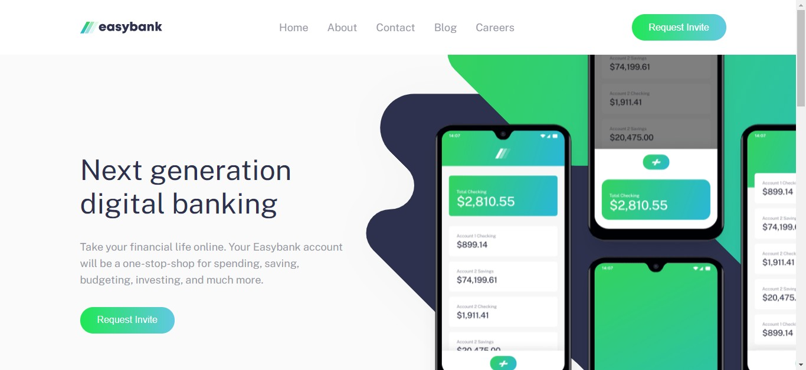

# Frontend Mentor - Easybank landing page



## Tecnologias utilizadas

- HTML
- CSS
- JAVASCRIPT

## Como baixar o projeto

### Clonar o repositório

```
$ git clone git@github.com:luiz-gustavo0/easybank-landing-page.git
```

### Entrar no diretorio

```
cd easybank-landing-page
```

## Author

- GitHub: [@luiz-gustavo0](https://github.com/luiz-gustavo0)
- LinkedIn: [@luiz-gustavo0](https://www.linkedin.com/in/luiz-gustavo0/)

## 📝 License

MIT
